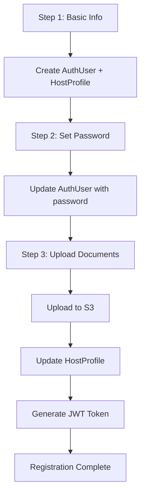
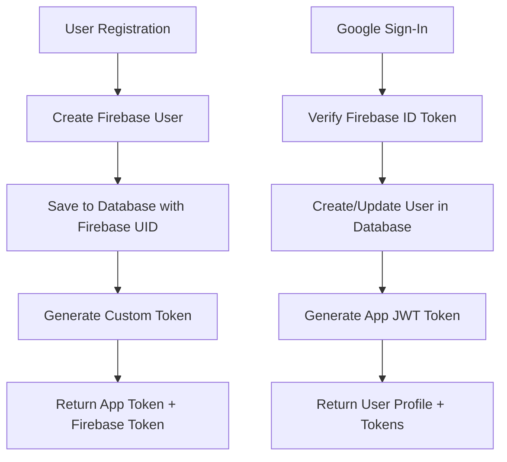

# Offbeat Backend - Authentication & Host Onboarding System

Welcome to the Offbeat Backend documentation. This system provides a comprehensive authentication and host onboarding solution with Firebase Authentication, multi-step registration, AWS S3 file uploads, and JWT authentication.

## 📚 Documentation Structure

### 🔗 Quick Links

- **[Swagger/OpenAPI](http://localhost:8080/api-docs)** - Interactive API documentation (when server is running)
- **[Getting Started](#getting-started)** - Quick setup guide
- **[Architecture Overview](#architecture-overview)** - System design and components

## 🚀 Getting Started

### Prerequisites

- Node.js (v16 or higher)
- MongoDB (local or cloud instance)
- AWS S3 bucket (for file uploads)
- Firebase project with Authentication enabled

### Installation & Setup

1. **Install Dependencies**

   ```bash
   npm install
   ```

2. **Firebase Configuration**

   ```bash
   # Copy the example service account key
   cp serviceAccountKey.json.example serviceAccountKey.json

   # Edit with your Firebase service account credentials
   # Download from Firebase Console > Project Settings > Service Accounts
   ```

3. **Environment Configuration**

   ```bash
   cp .env.dev.example .env.dev
   # Edit .env.dev with your configuration
   ```

4. **Seed Database**

   ```bash
   npm run seed:roles
   ```

5. **Run Database Migrations** (if needed)

   ⚠️ **Important**: Always backup your database before running migrations!

   ```bash
   # Update story schema (removes old date fields, adds storyLength)
   npm run migrate:stories
   ```

6. **Start Development Server**

   ```bash
   npm run dev
   ```

7. **View API Documentation**

   ```bash
   # Start server and visit: http://localhost:8080/api-docs
   ```

## 🏗️ Architecture Overview

### Core Components

#### 🔐 Authentication System

- **Firebase Authentication**: Primary authentication with Google Sign-In support
- **Traveller Registration**: Single-step registration with Firebase user creation
- **Host Onboarding**: Multi-step process with progress tracking
- **JWT Authentication**: Backup authentication for internal APIs
- **Role Validation**: ACTIVE role requirement enforcement
- **Google Sign-In**: Seamless OAuth integration with Firebase

#### 📁 File Management

- **AWS S3 Integration**: Direct file uploads with organized folder structure
- **Document Types**: Aadhar cards, PCC certificates, live pictures
- **File Validation**: Type and size restrictions
- **URL Generation**: Public S3 URLs for stored files

#### 🗄️ Database Design

### Multi-Step Host Onboarding Flow



### Firebase Authentication Flow



## 📖 API Documentation

### Authentication Endpoints

#### Register Traveller

```http
POST /api/auth/register-traveller
Content-Type: application/json

{
  "fullName": "John Doe",
  "email": "john@example.com",
  "password": "password123",
  "role": "traveller"
}
```

**Response:**

```json
{
  "success": true,
  "message": "Traveller registered successfully",
  "data": {
    "user": {
      "userId": "uuid",
      "fullName": "John Doe",
      "email": "john@example.com",
      "role": "traveller",
      "firebaseUid": "firebase-uid"
    },
    "token": "jwt-token",
    "firebaseToken": "firebase-custom-token"
  }
}
```

#### Login

```http
POST /api/auth/login
Content-Type: application/json

{
  "email": "john@example.com",
  "password": "password123"
}
```

#### Google Login

```http
POST /api/auth/google-login
Content-Type: application/json

{
  "idToken": "firebase-id-token-from-google-signin"
}
```

**Response:**

```json
{
  "success": true,
  "message": "Google login successful",
  "data": {
    "user": {
      "userId": "uuid",
      "fullName": "John Doe",
      "email": "john@gmail.com",
      "role": "traveller",
      "firebaseUid": "firebase-uid"
    },
    "token": "jwt-token",
    "firebaseToken": "firebase-id-token"
  }
}
```

{## 📖 API Documentation

"fullName": "John Doe",

"email": "john@example.com",### Authentication Endpoints

"password": "password123",

"role": "traveller"#### Register Traveller

}

````http

POST /api/auth/register-traveller

#### LoginContent-Type: application/json

```http

POST /api/auth/login{

Content-Type: application/json  "fullName": "John Doe",

  "email": "john@example.com",

{  "password": "password123",

  "email": "john@example.com",  "role": "traveller"

  "password": "password123"}

}```

````

#### Login

### Host Registration Endpoints

````http

#### Step 1: Basic InformationPOST /api/auth/login

```httpContent-Type: application/json

POST /api/host/register-step1

Content-Type: application/json{

  "email": "john@example.com",

{  "password": "password123"

  "fullName": "Jane Smith",}

  "email": "jane@example.com",```

  "age": 28,

  "gender": "Female",### Host Registration Endpoints

  "mobileNumber": "+1234567890",

  "nationality": "American",#### Step 1: Basic Information

  "role": "host"

}```http

```POST /api/host/register-step1

Content-Type: application/json

#### Step 2: Set Password

```http{

PATCH /api/host/register-step2/{userId}  "fullName": "Jane Smith",

Content-Type: application/json  "email": "jane@example.com",

  "age": 28,

{  "gender": "Female",

  "password": "securepassword123"  "mobileNumber": "+1234567890",

}  "nationality": "American",

```  "role": "host"

}

#### Step 3: Upload Documents```

```http

PATCH /api/host/register-step3/{userId}#### Step 2: Set Password

Content-Type: multipart/form-data

```http

location: "New York, USA"PATCH /api/host/register-step2/{userId}

aadharNumber: "123456789012"Content-Type: application/json

aadharFile: [file1.pdf, file2.jpg]

pccCertificateFile: pcc_cert.pdf{

livePicFile: live_pic.jpg  "password": "securepassword123"

```}

````

## 🔧 Development

#### Step 3: Upload Documents

### Available Scripts

```http

| Script | Description |PATCH /api/host/register-step3/{userId}

|--------|-------------|Content-Type: multipart/form-data

| `npm run dev` | Start development server with hot reload |

| `npm run build` | Build for production |location: "New York, USA"

| `npm run start` | Start production server |aadharNumber: "123456789012"

| `npm run seed:roles` | Seed database with initial roles |aadharFile: [file1.pdf, file2.jpg]

| `npm run type-check` | Run TypeScript type checking |pccCertificateFile: pcc_cert.pdf

| `npm run format` | Format code with Prettier |livePicFile: live_pic.jpg

```

### Project Structure

## 🔧 Development

```

src/### Available Scripts

├── Controller/           # Request handlers

│   ├── Auth/            # Authentication controllers| Script               | Description                              |

│   └── hostController.ts # Host onboarding controller| -------------------- | ---------------------------------------- |

├── Model/               # Database models| `npm run dev`        | Start development server with hot reload |

│   ├── authModel.ts     # AuthUser model| `npm run build`      | Build for production                     |

│   ├── hostModel.ts     # HostProfile model| `npm run start`      | Start production server                  |

│   └── roleModel.ts     # Role model| `npm run docs`       | Generate TypeDoc documentation           |

├── Routes/              # API route definitions| `npm run docs:serve` | Generate and serve docs locally          |

├── Service/             # Business logic services| `npm run seed:roles` | Seed database with initial roles         |

│   └── s3Service.ts     # AWS S3 file upload service| `npm run type-check` | Run TypeScript type checking             |

├── Utils/               # Utility functions| `npm run format`     | Format code with Prettier                |

├── Types/               # TypeScript type definitions

├── swagger/             # Swagger/OpenAPI documentation### Project Structure

└── Config/              # Configuration files

```

src/

## 🔒 Security Features├── Controller/ # Request handlers

│ ├── Auth/ # Authentication controllers

- **Password Hashing**: bcrypt with 12 salt rounds│ └── hostController.ts # Host onboarding controller

- **JWT Tokens**: 24-hour expiration, secure payload├── Model/ # Database models

- **File Validation**: Type and size restrictions│ ├── authModel.ts # AuthUser model

- **Role Verification**: ACTIVE role requirement│ ├── hostModel.ts # HostProfile model

- **Data Validation**: Comprehensive input validation│ └── roleModel.ts # Role model

- **SQL Injection Protection**: Mongoose ODM protection├── Routes/ # API route definitions

├── Service/ # Business logic services

## 📊 Database Schema│ └── s3Service.ts # AWS S3 file upload service

├── Utils/ # Utility functions

### Collections├── Types/ # TypeScript type definitions

├── swagger/ # Swagger/OpenAPI documentation

#### `authusers`└── Config/ # Configuration files

- `userId`: Unique identifier```

- `fullName`: User's full name

- `email`: Email address (unique)## 🔒 Security Features

- `password`: Hashed password (optional for hosts initially)

- `role`: User role (traveller/host)- **Password Hashing**: bcrypt with 12 salt rounds

- `isActive`: Account status- **JWT Tokens**: 24-hour expiration, secure payload

- **File Validation**: Type and size restrictions

#### `hostprofiles`- **Role Verification**: ACTIVE role requirement

- `hostId`: Unique host identifier- **Data Validation**: Comprehensive input validation

- `userId`: Reference to AuthUser- **SQL Injection Protection**: Mongoose ODM protection

- `age`, `gender`, `nationality`: Personal information

- `location`, `mobileNumber`: Contact information## 📊 Database Schema

- `aadharDocs[]`: Array of S3 URLs for Aadhar documents

- `pccCertificateUrl`: S3 URL for PCC certificate### Collections

- `livePicUrl`: S3 URL for live picture

- `onboardingStep`: Current step (1, 2, or 3)#### `authusers`

- `isOnboardingComplete`: Completion status

- `userId`: Unique identifier

#### `roles`- `fullName`: User's full name

- `roleId`: Unique role identifier- `email`: Email address (unique)

- `roleName`: Role name (traveller/host)- `password`: Hashed password (optional for hosts initially)

- `roleStatus`: Status (ACTIVE/INACTIVE)- `role`: User role (traveller/host)

- `isActive`: Account status

## 🚀 Deployment

#### `hostprofiles`

### Environment Variables

- `hostId`: Unique host identifier

```bash- `userId`: Reference to AuthUser

# Database- `age`, `gender`, `nationality`: Personal information

MONGODB_URI=mongodb://localhost:27017/offbeat-backend- `location`, `mobileNumber`: Contact information

- `aadharDocs[]`: Array of S3 URLs for Aadhar documents

# JWT- `pccCertificateUrl`: S3 URL for PCC certificate

JWT_SECRET=your-super-secret-jwt-key- `livePicUrl`: S3 URL for live picture

- `onboardingStep`: Current step (1, 2, or 3)

# AWS S3- `isOnboardingComplete`: Completion status

AWS_ACCESS_KEY_ID=your-aws-access-key

AWS_SECRET_ACCESS_KEY=your-aws-secret-key#### `roles`

AWS_REGION=us-east-1

AWS_S3_BUCKET_NAME=your-s3-bucket-name- `roleId`: Unique role identifier

- `roleName`: Role name (traveller/host)

# Server- `roleStatus`: Status (ACTIVE/INACTIVE)

PORT=8080

NODE_ENV=production## 🚀 Deployment

````

### Environment Variables

### Build & Deploy

```bash

```bash# Database

# Build the applicationMONGODB_URI=mongodb://localhost:27017/offbeat-backend

npm run build

# JWT

# Start production serverJWT_SECRET=your-super-secret-jwt-key

npm start

```# AWS S3

AWS_ACCESS_KEY_ID=your-aws-access-key

## 🤝 ContributingAWS_SECRET_ACCESS_KEY=your-aws-secret-key

AWS_REGION=us-east-1

1. Follow TypeScript best practicesAWS_S3_BUCKET_NAME=your-s3-bucket-name

2. Add comprehensive code comments

3. Update documentation when adding features# Server

4. Run tests before submitting PRsPORT=8080

5. Follow the established project structureNODE_ENV=production

````

## 📄 License

### Build & Deploy

ISC License - See LICENSE file for details

```bash

---# Build the application

npm run build

**API Documentation**: Complete interactive API documentation is available via Swagger UI at `/api-docs` when the server is running.
# Start production server
npm start
```

## 🤝 Contributing

1. Follow TypeScript best practices
2. Add comprehensive JSDoc comments
3. Update documentation when adding features
4. Run tests before submitting PRs
5. Follow the established project structure

## 📄 License

ISC License - See LICENSE file for details

---

**Generated Documentation**: The complete API documentation is available in the `/docs` folder, generated using TypeDoc with comprehensive JSDoc comments throughout the codebase.
