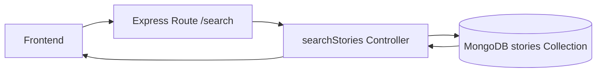

# Booking Search Architecture Diagram

```mermaid
graph TD;
    A[Frontend Search Request]\n    -->|POST /api/bookings/search\n    with { place, startDate, totalPeople }| B[SearchStories Controller];

    B --> C[Input Validation];

    C --> D[Geo Query (MongoDB $near on locationDetails.geoPoint, 500km radius)];

    D -->|Approved Stories| E[Initial Story Set];

    E --> F[Additional Queries by District/State if < limit];

    F --> G[Combine Result Sets];

    G --> H[Availability Filtering];

    H --> I[Scoring Engine];

    subgraph Scoring Engine
      I1[Text Score: +100 name/suburb/town] --> I2
      I2[Boundary Score: +30 district\n+20 state] --> I3
      I3[Tag Score: +10 per match] --> I4
      I4[Distance Score: 100 - (km * 2)] --> I5
      I5[Availability Bonus: +25] --> I6
      I6[Capacity Bonus: +15] --> I7
    end

    I7 --> J[Final Score Computed per Story];

    J --> K[Calculate Pricing];

    K -->|Sort by finalScore DESC| L[Limit Results];

    L --> M[API Response to Client: {results, total}];
```

# MongoDB Collections & Structures

## stories Collection (Single Document Example)

```json
{
  "storyId": "uuid",
  "storyTitle": "Cherai Beach Day Trip",
  "storyDescription": "...",
  "state": "Kerala",
  "location": "Cherai",
  "locationDetails": {
    "lat": 10.5950431,
    "lon": 76.0417924,
    "geoPoint": { "type": "Point", "coordinates": [76.0417924, 10.5950431] },
    "displayName": "Guruvayur, Thrissur, Kerala",
    "name": "Guruvayur",
    "town": "Guruvayur",
    "district": "Thrissur",
    "state": "Kerala",
    "postcode": "680101",
    "country": "India",
    "countryCode": "in",
    "boundingBox": [10.5550431, 10.6350431, 76.0017924, 76.0817924]
  },
  "tags": ["temple", "culture", "family"],
  "availabilityType": "YEAR_ROUND",
  "maxTravelersPerDay": 20,
  "pricingType": "Per Person",
  "amount": 1500,
  "storyImages": {
    "bannerImage": { "url": "..." }
  }
}
```

# Search Flow Summary

1. User selects place → frontend sends lat/lon + date + people.
2. Backend validates request.
3. MongoDB `$near` identifies closest stories using 2dsphere index.
4. If insufficient results → fallback search by district/state/name.
5. Stories are filtered for availability & capacity.
6. Scoring system ranks each story:
   - Text match relevance
   - Administrative match
   - Distance decay
   - Tag match relevance
   - Date & capacity bonuses

7. Pricing is calculated:
   - Per Person → people × amount
   - Per Day → use totalPrice

8. Add dynamic price note based on selected month.
9. Limited results returned to frontend.

# System Components

- **Frontend:** Sends structured search payload.
- **Backend Controller:** Manages validation, geo-querying, scoring, and formatting.
- **MongoDB:** Stores stories with `locationDetails` and 2dsphere index.
- **Scoring Engine:** Determines the order of relevance.
- **Pricing Calculator:** Computes final displayed price.

# Indexes Required

```js
StorySchema.index({ 'locationDetails.geoPoint': '2dsphere' });
```

# High-Level Architecture


